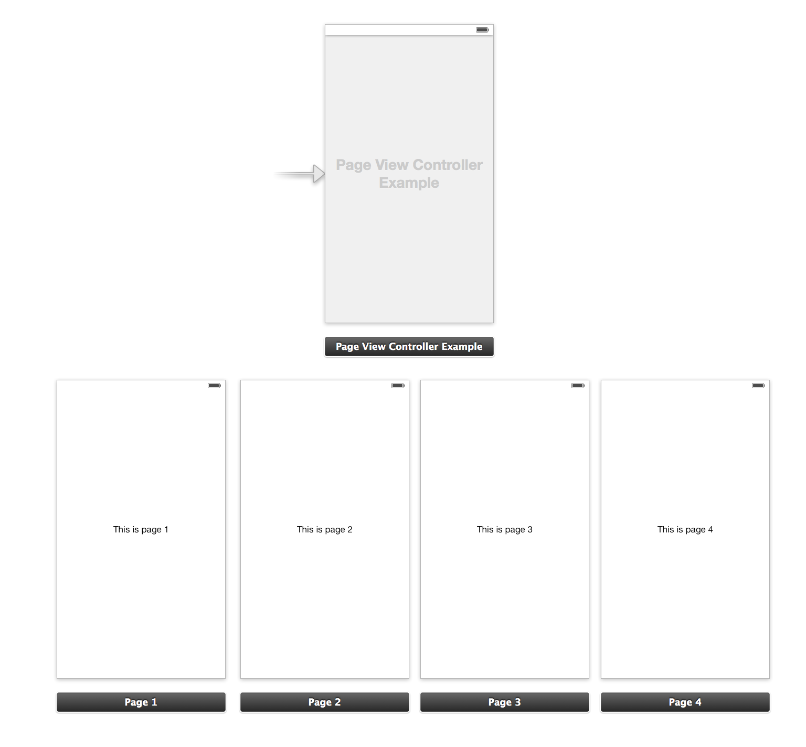

BMPageViewController
====================

## Description:
Did you ever want to implement a simple ```UIPageViewController``` and realized that you had to do it all by code?
With ```BMPageViewController``` you will be able to design each page from a single storyboard!



## How to Use:
First you must create a [subclass of ```BMPageViewController```](BMPageViewController/Source/BMPageViewController+Protected.h) and override ```-pageIdentifiers```. Example:
```objc
- (NSArray *)pageIdentifiers {
	return @[@"page1", @"page2"];
}
```

Then you have to create a storyboard, add a ```UIPageViewController``` object and change its class to ```BMPageViewController```.
Then you can add the controllers, setting their ```Storyboard ID```s to what you returned in ```pageIdentifiers```.
Each of them must be a class that conforms to ```BMPageViewControllerChild``` (if you don't need to add any extra functionality to it you can use [```BMPageViewControllerPage```](BMPageViewController/Source/BMPageViewControllerPage.h)).

When your controller is instantiated, it will use these controllers to create each page.

Make sure you also check out the sample project in this repo.

## Alternate use:
If you need all your pages to look the same, but providing different data, you can create a single page in the storyboard and return it as many times as you need:
```objc
- (NSArray *)pageIdentifiers {
	return @[@"page1", @"page1", @"page1"];
}
```

Then in your ```BMPageViewController``` subclass you can override this method to configure each page:
```objc
- (void)setUpViewController:(MyCustomControllerPage *)page
                    atIndex:(NSInteger)index  {
	[super setUpViewController:page atIndex:index];

	page.customData = [self dataForPageAtIndex:index];
}
```

## Instalation:
- Using [Cocoapods](http://cocoapods.org/):

Just add this line to your `Podfile`:

```
pod 'BMPageViewController', '~> 1.0.0'
```

- Manually:

Simply add the files under [Source](BMPageViewController/Source) to your project.

## Compatibility

- Requires ARC. If you want to use it in a project without ARC, mark the implementation files with the linker flag ```-fobjc-arc```.
- Supports iOS iOS6+.

## License
`BMPageViewController` is available under the WTFPL license. See the [LICENSE file](LICENSE) for more info.
